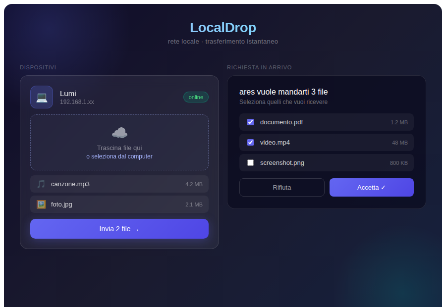

# AirDrop Locale

**Peer-to-peer file transfer on your local network — no internet, no cables, no accounts.**



Devices on the same Wi-Fi discover each other automatically. Select a file, pick a device, send. That's it.

---

## Features

- Automatic device discovery via local network broadcast
- No internet connection required
- No account, no cloud, no third-party server
- Clean glassmorphism UI built with React + Tauri
- Python backend handles discovery and transfer logic

---

## Tech Stack

| Layer | Technology |
|---|---|
| Desktop shell | [Tauri](https://tauri.app/) (Rust) |
| Frontend | React |
| Backend | Python (with virtualenv) |
| Transport | Local network (LAN) |

---

## Supported Platforms

| Platform | Status |
|---|---|
| Windows | ✅ Tested |
| Ubuntu / Linux | ✅ Tested |
| macOS | ⚠️ Not tested — should work, PRs welcome |

---

## Installation

### For users

Download the installer for your platform from the [Releases](https://github.com/Ar3s-bo/Localdrop/releases) page:

| Platform | File |
|---|---|
| Windows | `AirDrop-Locale_x.x.x_x64.msi` |
| Ubuntu / Linux | `airdrop-locale_x.x.x_amd64.deb` |

No additional dependencies required — just install and run.

---

### For developers

**Requirements:**
- [Node.js](https://nodejs.org/) (v18+)
- [Python](https://www.python.org/) (v3.10+)
- [Rust + Cargo](https://www.rust-lang.org/tools/install)
- Tauri CLI (`cargo install tauri-cli`)

```bash
# 1. Clone the repo
git clone https://github.com/Ar3s-bo/Localdrop.git
cd Localdrop

# 2. Set up Python backend
cd backend
python -m venv venv
source venv/bin/activate        # Windows: venv\Scripts\activate
pip install -r requirements.txt
cd ..

# 3. Install frontend dependencies
npm install

# 4. Run in development mode
npm run tauri dev
```

**Build:**
```bash
npm run tauri build
```
Output binary in `src-tauri/target/release/`.

---

## How It Works

1. On launch, the Python backend broadcasts a presence signal on the local network
2. Other instances of AirDrop Locale on the same network respond and appear in the UI
3. The sender selects a file and a target device
4. The file transfers directly between the two machines — no relay, no server

---

## Project Status

Active development. Core transfer functionality is working.
Contributions and issue reports are welcome.

---

## License

MIT
